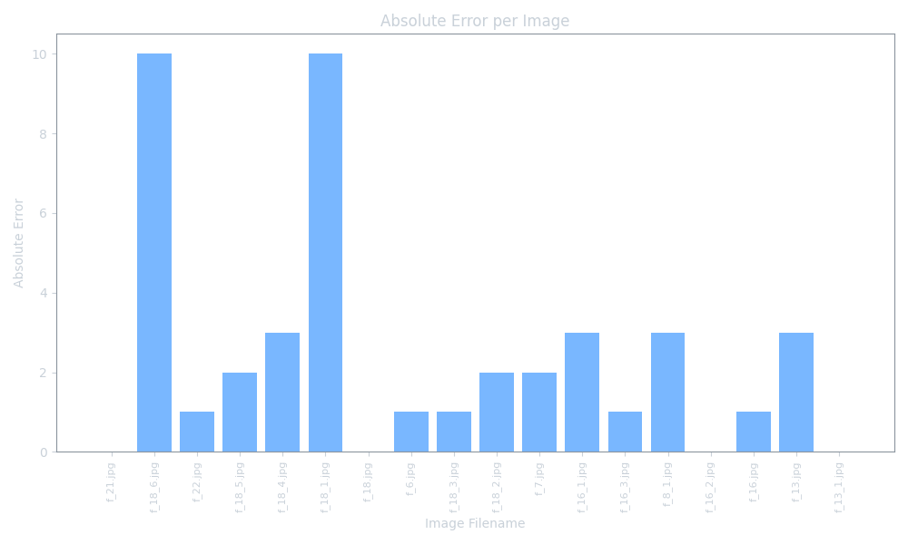
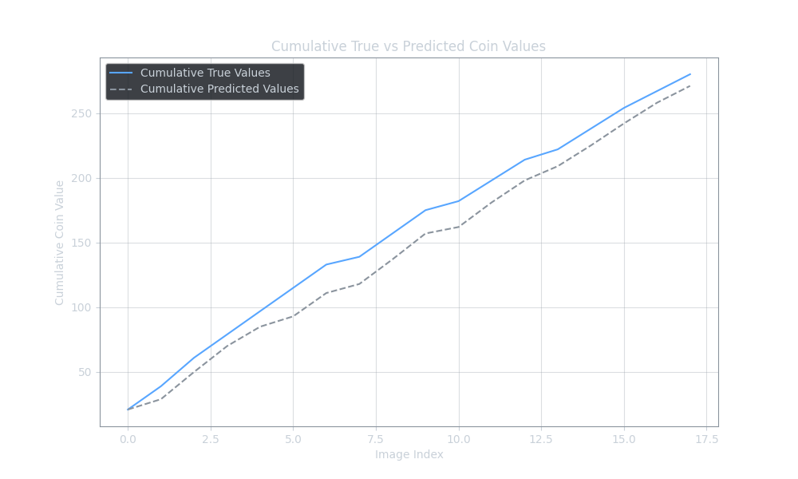

# coin-vision

<a target="_blank" href="https://cookiecutter-data-science.drivendata.org/">
    
</a>

The coin-vision Project is a computer vision application designed to identify and extract one or more coins from images. It makes use of the [YOLOv8](https://yolov8.com/) object detection model for initial identification and [MobileNetV2](https://arxiv.org/abs/1801.04381) for coin classification.

## Workflow

### Detect
Using [YOLOv8](https://yolov8.com/)  the code first detects circular or oval shapes that correspond to coins in various image formats. Coins are extracted in 240x240 boxes for further classification

### Filter
Filters are applied on the generated boxes, first, duplicated boxes are removed, then boxes that contain non oval\round objects are filtered out

### Classify
With the remaining boxes the code runs classification using [MobileNetV2](https://arxiv.org/abs/1801.04381) . Each coin will be classified as one of 8 classes or Israeli NIS coins. If a coin can not be identified with a threshold defined in `COIN_CLASSIFICATION_PROB_THRESHOLD`, the coin is classified as class NONE

### Calculate
Calculate the value of the coins found in the image

It outputs the value of the coins presented in the picture.


# Results
Below are the results of running detection on multi coin images

## Absolute error per image


## Cummlative true vs predicted



# Usage

## Installation

### 1. Install Dependencies

Ensure you have Python installed, then install the required packages using requirements.txt:

```bash
pip install -r requirements.txt
```

### 2. Verify Installation

Confirm all dependencies are installed correctly:

```bash
python -m pip check
```

## Command-Line Usage

Run the main script using the following command-line options to perform specific actions:

### General Syntax

```bash
python main.py --action <action>
```

### Available Actions

1. detect

    Description: Detects coins in the input images and saves the results.

2. label

    Description: Label detected coin images for further processing or training.

3. train

    Description: Train and evaluate a machine learning model (e.g., MobileNetV2) using labeled coin data.

4. test_gpu

    Description: Test if your GPU is being utilized correctly for computations.

5. run

    Description: Calculate the total value of coins in images.


## Example Workflow

1. Detect coins in the raw images:

    ```bash
    python main.py --action detect
    ```

2. Label the detected coins for classification:

    ```bash
    python main.py --action label
    ```

3. Train the model using labeled coin data:

    ```bash
    python main.py --action train
    ```

4. Calculate the total value of coins in labeled multi-coin images:

    ```bash
    python main.py --action run
    ```

## Notes

- Ensure the configuration paths (config.RAW_IMAGES_FOLDER, config.DETECTION_RESULTS_FOLDER, etc.) are set up correctly in your project configuration file.
- GPU support is optional but highly recommended for faster detection and processing performance.


## Project Organization

```
├── LICENSE            <- Open-source license if one is chosen
├── Makefile           <- Makefile with convenience commands like `make data` or `make train`
├── README.md          <- The top-level README for developers using this project.
├── data
│   ├── external       <- Data from third party sources.
│   ├── interim        <- Output of internal training and work
│   ├── processed      <- The final images to be used for training and testing
│   └── raw            <- The original uploaded images, raw
│
├── docs               <- A default mkdocs project; see www.mkdocs.org for details
│
├── models             <- Trained and serialized models, model predictions, or model summaries
│
├── notebooks          <- Jupyter notebooks. Naming convention is a number (for ordering),
│                         the creator's initials, and a short `-` delimited description, e.g.
│                         `1.0-jqp-initial-data-exploration`.
│
├── pyproject.toml     <- Project configuration file with package metadata for
│                         coin_vision and configuration for tools like black
│
├── references         <- Data dictionaries, manuals, and all other explanatory materials.
│
├── reports            <- Generated analysis as HTML, PDF, LaTeX, etc.
│   └── figures        <- Generated graphics and figures to be used in reporting
│
├── requirements.txt   <- The requirements file for reproducing the analysis environment, e.g.
│                         generated with `pip freeze > requirements.txt`
│
├── setup.cfg          <- Configuration file for flake8
│
└── coin_vision   <- Source code for use in this project.
    │
    ├── __init__.py             <- Makes coin_vision a Python module
    │
    ├── config.py               <- Store useful variables and configuration
    │
    ├── dataset.py              <- Scripts to download or generate data
    │
    ├── features.py             <- Code to create features for modeling
    │
    ├── modeling                
    │   ├── __init__.py
    │   ├── predict.py          <- Code to run model inference with trained models          
    │   └── train.py            <- Code to train models
    │
    └── plots.py                <- Code to create visualizations
```

--------
